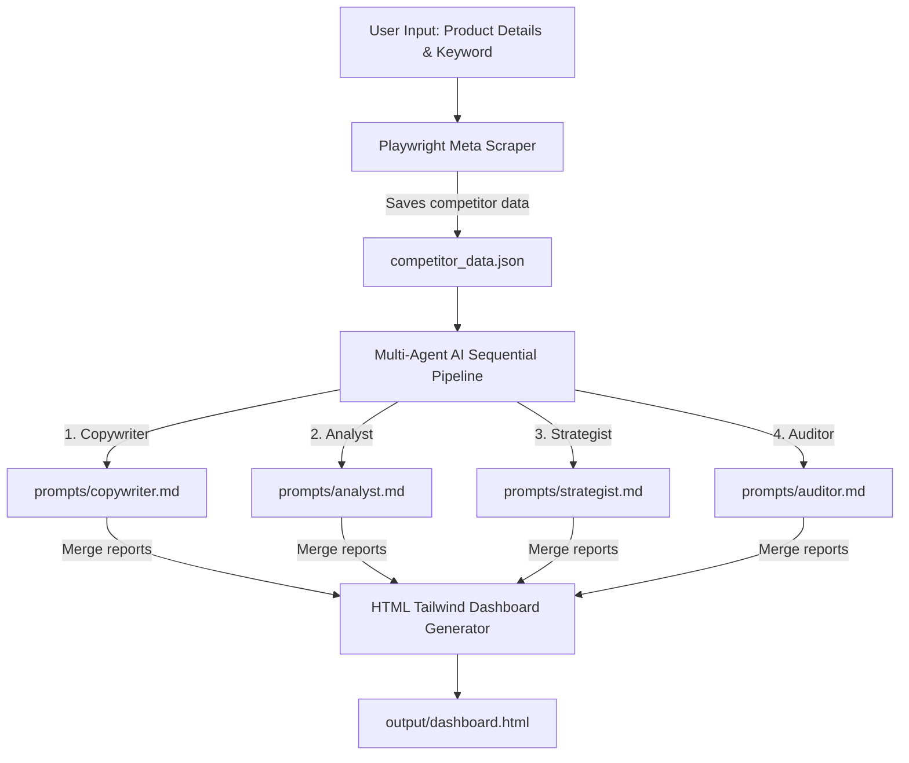

# Ads Autonomous CLI - Application Guide 🛠️

Welcome to the core application folder of **Ads Autonomous CLI**. This directory contains the complete code for the automated Playwright competitor scraper, the multi-agent AI marketing pipeline, and the companion React + Express web application.

---

## 🌟 Architecture & Workflow

The workspace orchestrates an automated marketing campaign workflow in four main steps:



---

## 🚀 Execution & Command-Line Usage

### Prerequisites
Make sure you have Node.js (v18+) and standard npm package managers installed.

### 1. Installation
Install all backend, frontend, scraping, and styling dependencies:
```bash
npm install
```

### 2. Launching the Autopilot Assistant
Run the comprehensive marketing assistant CLI using the provided shell runner. It runs in a safe rate-limit prevention mode:
```bash
chmod +x run-assistant.sh
./run-assistant.sh
```

### 3. Step-by-Step Under the Hood

#### A. Scrape Competitor Ads
The scraper automates standard browser sessions to target competitor ads:
```bash
node scrape-ads.js "<competitor-keyword>"
```
- **Output File**: `output/competitor_data.json`
- **Target URL**: Combines filters to target Indonesian active ads: `https://www.facebook.com/ads/library/?active_status=all&ad_type=all&country=ID&q=<keyword>`

#### B. Trigger Sequential Marketing Agent Roles
The script feeds user details and scraped competitor insights through Gemini policies:
- **Copywriter**: Uses `prompts/copywriter.md` to design direct-response copy variations.
- **Analyst**: Uses `prompts/analyst.md` to compute industry-standard KPI estimates (CPM, CPC, CTR) and models small, medium, and high-budget scenarios in tables.
- **Strategist**: Uses `prompts/strategist.md` to compile target buyer personas, create a detailed brief for visual designers, and recommend landing page landing angles.
- **Auditor**: Uses `prompts/auditor.md` to run competitor audits, evaluate USPs, and recommend counter-offers.

#### C. Build Final HTML Dashboard
The final step compiles all generated markdown reports into a gorgeous, clean single-page dashboard using Tailwind CSS:
- **Output File**: `output/dashboard.html`
- **How to view**: Simply run `open output/dashboard.html` in your terminal.

---

## 💻 Full-Stack Companion Application

This subdirectory also includes a dynamic companion dashboard and Express API server.

### Available Scripts

| Command | Description |
| :--- | :--- |
| `npm run dev` | Launch the **Vite + React** frontend dev environment. |
| `npm run start` | Run the **Express + TypeScript** backend server. |
| `npm run build` | Bundles and builds the Vite frontend and compiles TypeScript source code. |
| `npm run serve` | Serves the production bundle output. |

### Express API Reference

The Express server (`src/index.ts`) runs on port `3000` by default. It provides the following endpoints:

#### 1. Check API Health
- **Endpoint**: `GET /api/health`
- **Response**:
  ```json
  {
    "status": "ok",
    "message": "AI Marketing Dashboard API is running"
  }
  ```

#### 2. Get Compiled Campaign Data
Reads all compiled markdown analysis reports from the `output/` directory, compiles them into a unified key-value object, and serves it as JSON:
- **Endpoint**: `GET /api/campaign-data`
- **Response**:
  ```json
  {
    "copywriter": "# Direct-Response Copy...",
    "analyst": "# Performance Budget Scenario...",
    "strategist": "# Targeted Buyer Personas...",
    "auditor": "# Competitor & Market Audit..."
  }
  ```

---

## 🎨 Styling and Configs
- **Tailwind CSS**: Core classes and tokens are integrated via `@tailwindcss/typography` and the core v4 layout.
- **TypeScript**: Full type safety configurations are defined in `tsconfig.json`.
- **Formatting**: Linter rules and formatting rules are configured in `eslint.config.js` and `.prettierrc`.
